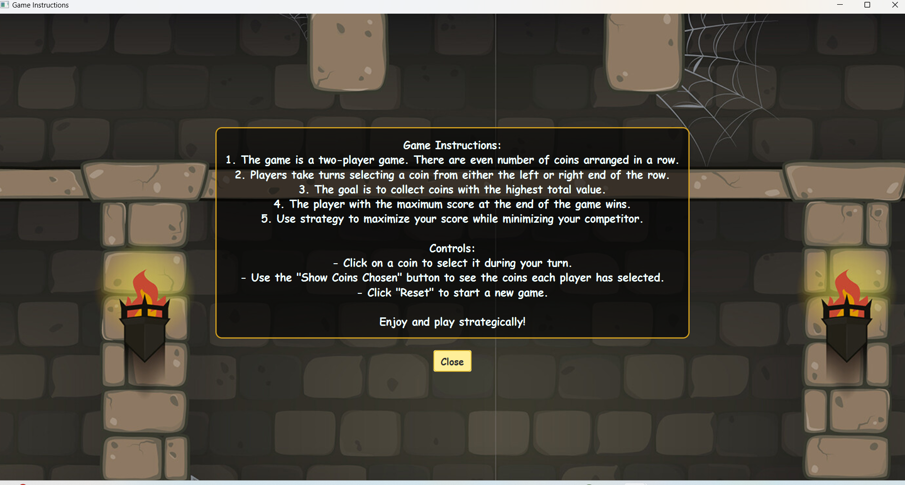

# 🧠 Optimal Strategy for a Game using Dynamic Programming
This project was developed as a component of the Algorithm analysis course. A Java project employing dynamic programming to implement the Optimal game strategy of coins.            

## 🎮 Problem Description
This is a two-player game. There are even number of coins arranged in a row. There will be 
alternate turns. In each turn, a player can either select the first coin in the row or the last coin in 
the row and keep it with him. The objective of the problem is to determine the maximum 
possible amount of money a player can definitely win, if he moves first.  

### 🧩 Expected Input and Output
Coins [] = 4, 15, 7, 3, 8, 9 

Expected result=27 

## 💻 Screenshots

